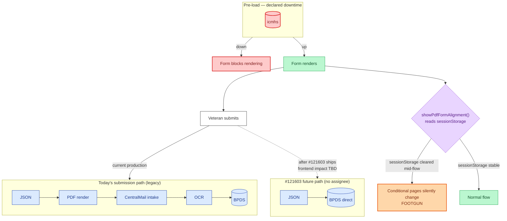

# 530EZ — Downtime & Off-ramps

The 530's submission pipeline is mid-migration. Today: JSON → PDF → CentralMail → OCR → BPDS. Eventually (#121603): JSON → BPDS directly.

## Reading notes

- **icmhs is again the only declared dependency.** Same caveat as 527EZ.
- **The "Today's submission path (legacy)" lane** is the slow path — PDF rendering and OCR add latency and OCR error rates. POI (Pension Optimization Initiative) is funding the move to direct BPDS.
- **The "#121603 future path" lane is dotted** — not yet wired in production. #121603 has no assignee on the epic; ownership unclear.
- **The orange `Conditional pages silently change / FOOTGUN` node** is the sessionStorage foot-gun. Tests that mock `burialPdfFormAlignment` via Redux only will not match runtime behavior; if anything clears `sessionStorage` mid-flow (e.g., navigating across tabs, plugin behavior), the toggle effectively flips for that user.
- **`version: 3 → 4` migration** at `config/form.js:100` ships in lockstep with the toggle going live. SIP records started under v3 must migrate cleanly.
