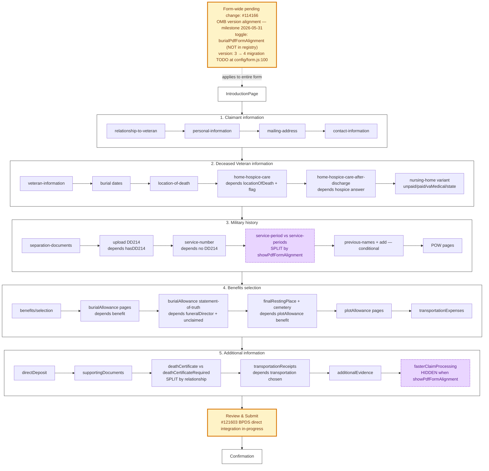

# 530EZ — Main Flow

Source: `src/applications/burials-ez/config/form.js`. Five chapters; many `depends:` gates driven by `view:claimedBenefits.*`, `relationshipToVeteran`, and the `showPdfFormAlignment` toggle.

`showPdfFormAlignment` is a session-storage check (`utils/helpers.jsx:166`) populated from the `burialPdfFormAlignment` Redux feature toggle in `BurialsApp.jsx:46-56` — i.e. the toggle is mirrored into sessionStorage so synchronous `depends:` functions can read it. **The toggle is absent from `featureFlagNames.json`.** (TBD: confirm with team.)

## Reading notes

- **`Note` (yellow-orange)** is the form-wide pending change for #114166 plus the lurking `version: 3 → 4` SIP migration foot-gun at `config/form.js:100`.
- **`C3d` and `C5f` are purple-dotted** — both are direct `showPdfFormAlignment` forks. C3d picks between `service-period` and `service-periods`; C5f hides `fasterClaimProcessing` entirely when the toggle is on.
- **`C5c` is the relationship-driven split** — funeral director sees `deathCertificateRequired`; everyone else sees `deathCertificate`. Easy to break by editing one and forgetting the other.
- **`Review` is yellow-orange** because #121603 (BPDS integration) will eventually rewire the submission path; today it still goes JSON → PDF → CentralMail → OCR → BPDS.
