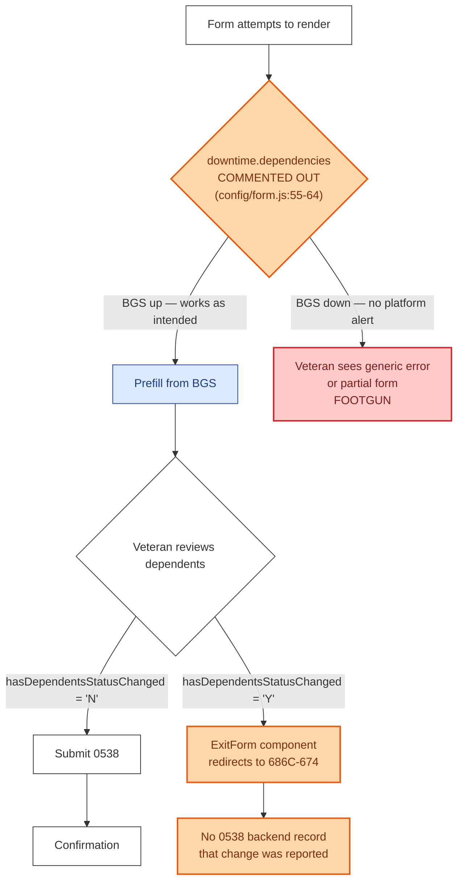

# 0538 — Downtime & Off-ramps

The 0538 has a **suspicious** downtime story: `downtime.dependencies` is fully commented out at `config/form.js:55-64`. This is a prefill-required form that depends on BGS for dependent records, but the platform's downtime detection doesn't know about it.

## Reading notes

- **The orange `downtime.dependencies COMMENTED OUT` decision node** is the most important thing to fix or document. The original commented block included BGS, MVI, VA Profile, VBMS — re-enable with the team's blessing if no specific reason exists for the disable.
- **The red `Veteran sees generic error / FOOTGUN` node** is what Veterans see today during a real BGS outage: no platform downtime alert, just whatever the prefill request happens to throw.
- **The orange `ExitForm component — redirects to 686C-674` node** is the silent off-ramp. Veterans intend to update dependents, hit "yes things changed," and end up on a new form. The 0538 has no record they ever started — not great for analytics or follow-up.
- **The `No 0538 backend record` callout** is connected to the warning-alert / 8-year-diary-date issue documented in the view-dependents README — there's no API for the BGS diary date, so the alert is time-based rather than intelligent.
