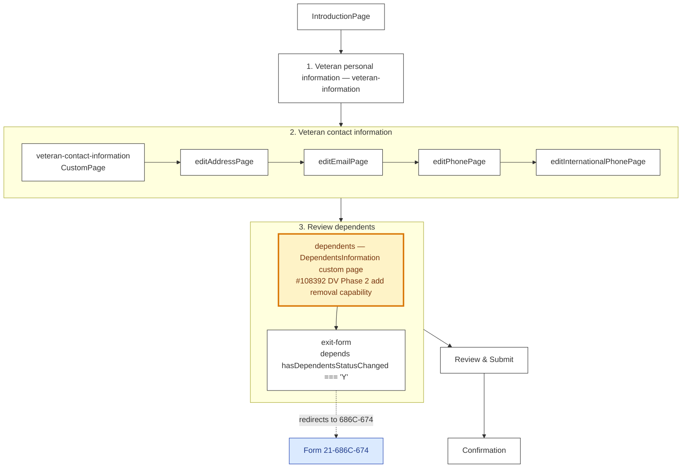

# 0538 — Main Flow

Source: `src/applications/dependents/dependents-verification/config/form.js`. Two real outcomes per the in-app README: (1) confirm dependents are up-to-date and submit, or (2) report status changed → ExitForm redirects to the 686C-674.

## Reading notes

- **The yellow-orange `dependents — DependentsInformation custom page` node** is where #108392 Phase 2 lands if removal capability gets built into the 0538 (rather than picklist in 686). Path TBD.
- **The `exit-form` node is a redirect, not a submission.** Veterans who say "yes, things changed" never submit a 0538 — they're sent to the 686. There's no audit trail of that intent in the 0538 backend.
- **No `defaultDefinitions`** — schemas live per-chapter; same as 0969.
- **The legacy embedded 0538** in `view-dependents/manage-dependents/` is a separate, dormant code path gated by `manageDependents`. Not shown here. Don't accidentally revive it.
