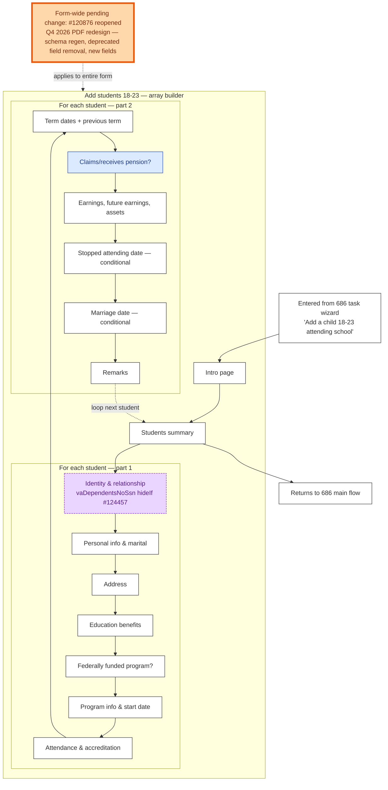

# 674 — Main Flow

Source: `src/applications/dependents/686c-674/config/chapters/formConfig674.js` and `config/chapters/674/addStudentsArrayPages.js`. Built with `arrayBuilderPages` — Veteran can add multiple students. The chapter only renders when `view:addOrRemoveDependents.add` is true and the user picked the "add student" task.

For failure modes, see [686c-offramp.md](686c-offramp.md) — 674 inherits 686c's submission and downtime story.

## Reading notes

- **`Note` (orange-bordered)** flags the form-wide reopened scope: #120876 PDF redesign will churn schemas, prefill transformers, and probably page modules.
- **`Identity`** is purple-dotted because of the `vaDependentsNoSsn` hideIf gate (`config/chapters/674/studentIdentityPages.js:49`).
- **`Pension`** is blue because the "claims/receives pension" answer participates in the pension-API fork that flows through the 686.
- **The loop edge from `Remarks` back to `Summary`** is the array-builder pattern — Veteran can add another student or move on.
