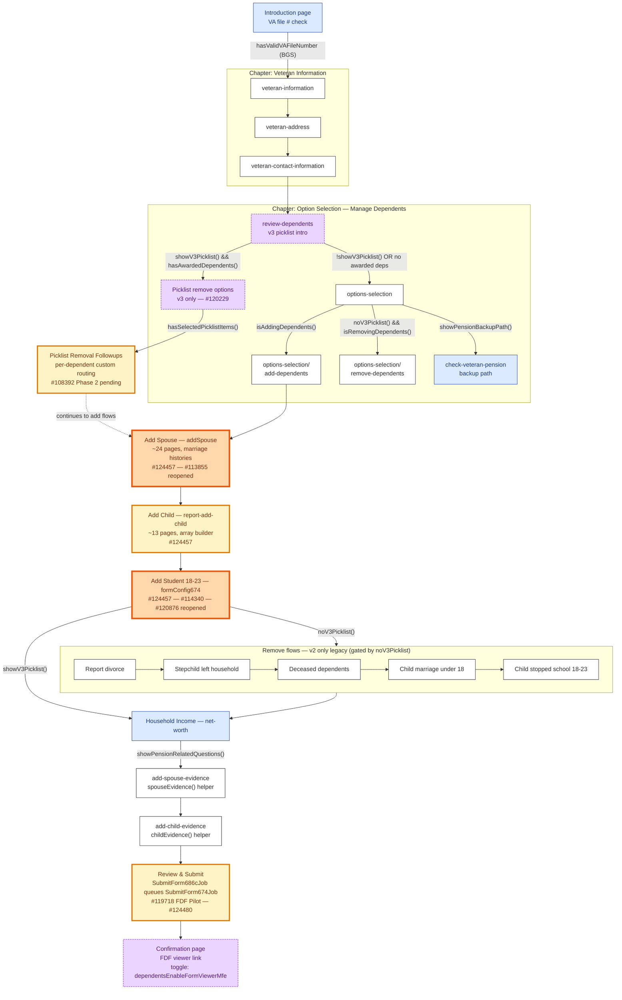

# 686c — Main Flow

Source: `src/applications/dependents/686c-674/config/form.js` plus chapter modules under `config/chapters/`.

Edges are labeled with the gate that controls the transition. Issue badges in node labels reference the relevant epic; full links are in the [main briefing's 686c issue index](../kt_form_briefing.md#vaf21-686c--application-request-to-add-andor-remove-dependents).

## Reading notes

- **`review-dependents` → `Picklist remove options` vs `review-dependents` → `options-selection`** is the v2/v3 fork. `vaDependentV2Flow !== true` is the third state that decides which side a Veteran lands on; see the picklist deep-dive in the main briefing.
- **`Add Spouse` and `Add Student 18-23`** are marked reopened because they each carry an open reopened issue (#113855 and #120876 respectively).
- **The `check-veteran-pension` backup-path node** only appears when the pension API call fails — it's the manual fallback for `dependents_pension_check`.
- **`Picklist Removal Followups`** is one logical node here but in code it's a router; see [686c-picklist-subflow.md](686c-picklist-subflow.md).
