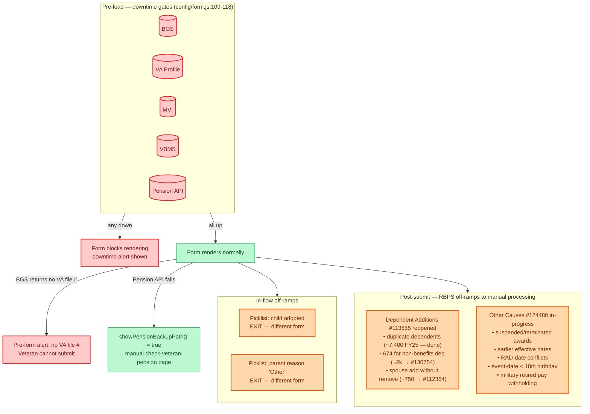

# 686c — Off-ramps & Downtime

Failure modes for the 686. Three classes:

1. **Pre-load downtime** — external systems are down before the form even renders.
2. **In-flow off-ramps** — the form renders but Veteran has to leave (e.g., adopted child branch).
3. **Submission off-ramps to RBPS manual processing** — form submits successfully, but RBPS rejects the case to a human adjudicator.

## Reading notes

- **Red = full downtime.** Form won't render, Veteran sees the platform downtime alert.
- **Orange = off-ramp.** Form does work, but the Veteran's case gets routed away from automated processing.
- **Green = recovery path.** The form has a graceful fallback (e.g., manual pension question when the API is down).
- **RBPS sits behind BGS.** A BGS outage looks identical to "rules-based processing rejected your case" from the Veteran's perspective; ops should distinguish.
- **The `#113855` and `#124480` boxes** are intentionally listed as a checklist — those are the scenarios the team is choosing whether to pre-emptively block in VA.gov vs allow-and-let-RBPS-reject.
