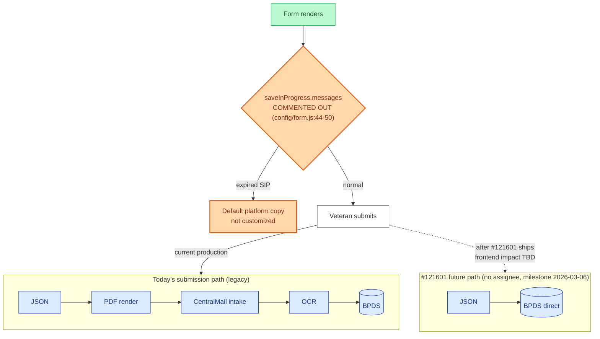

# 0969 — Downtime & Off-ramps

The 0969's external surface is essentially nil today on the FE side — submission goes through the same legacy CentralMail-via-PDF route as 530EZ, scheduled to be replaced by direct BPDS via #121601.

## Reading notes

- **No declared `downtime.dependencies`.** The 0969 doesn't declare external dependencies — different from 527EZ (icmhs only) and 686 (BGS/Profile/MVI/VBMS). If a Veteran hits a vets-api outage during submission, they'll see generic platform errors.
- **The `SaveCopy` orange node** is the commented-out `saveInProgress.messages` foot-gun. Veterans get the platform default copy when SIP expires; if you ever need to customize that copy, this is where to do it.
- **`SubmitFuture` is dotted** — same status as 530's BPDS work. No assignee on the epic; FE side TBD.
- **Email-notification toggles** (per the in-app README) suggest there's a notification path on submit/error/persistent-attachment-error, but the four toggles are not yet found in `featureFlagNames.json`. Not mapped here; ask the team.
