# 0969 — Main Flow

Source: `src/applications/income-and-asset-statement/config/form.js` and chapter index files. Heavy use of array-builder for sections 2-11. Page-level flow omitted for readability — see `config/chapters/`.

```mermaid
flowchart TB
  subgraph Row1["Identity & contact"]
    direction LR
    Intro[IntroductionPage]:::frontend --> Ch1["1. Veteran & claimant info<br/>claimantType, personalInformation,<br/>claimantInformation, emailAddress,<br/>phoneNumber, otherVeteranInformation,<br/>dateReceivedBy, incomeNetWorthDateRange"]:::frontend
  end

  subgraph Row2["Current income & accounts"]
    direction LR
    Ch2["2. Recurring income<br/>unassociatedIncomePages — array builder"]:::frontend --> Ch3["3. Financial accounts<br/>associatedIncomePages — array builder"]:::frontend
  end

  subgraph Row3["Property, business & investment assets"]
    direction LR
    Ch4["4. Property & business assets<br/>ownedAssetPages"]:::frontend --> Ch5["5. Royalties & other assets<br/>royaltiesAndOtherPropertyPages"]:::frontend --> Ch6["6. Asset transfers<br/>assetTransferPages"]:::frontend
  end

  subgraph Row4["Trusts, annuities & other holdings"]
    direction LR
    Ch7["7. Trusts<br/>trustPages"]:::frontend --> Ch8["8. Annuities<br/>annuityPages"]:::frontend --> Ch9["9. Other assets<br/>unreportedAssetPages"]:::frontend
  end

  subgraph Row5["Income changes & submission"]
    direction LR
    Ch10["10. Discontinued income<br/>discontinuedIncomePages"]:::frontend --> Ch11["11. Waived income<br/>incomeReceiptWaiverPages"]:::frontend --> PreSubmit["Custom PreSubmitInfo<br/>statementOfTruth name varies by claimantType<br/>#121601 BPDS integration in-progress"]:::inProgress --> Confirmation[Confirmation]:::frontend
  end

  Ch1 --> Ch2
  Ch3 --> Ch4
  Ch6 --> Ch7
  Ch9 --> Ch10

  classDef frontend fill:#ffffff,stroke:#333333,stroke-width:1px;
  classDef toggle fill:#e9d5ff,stroke:#7e22ce,stroke-width:1px,stroke-dasharray:4 2,color:#581c87;
  classDef inProgress fill:#fef3c7,stroke:#d97706,stroke-width:3px,color:#78350f;
```

## Reading notes

- **`statementOfTruth.fullNamePath`** is a function returning `'veteranFullName'` or `'claimantFullName'` based on `claimantType` (`config/form.js:91-96`). The custom PreSubmit lives at `containers/PreSubmitInfo.jsx`.
- **10 of 11 chapters are array-builders.** Per-row schema changes need ID stability across save-in-progress.
- **No JSON schema import.** `config/form.js:1` has the import commented out — schemas are defined per-chapter inside this app. Confirm with team whether deliberate.
- **`saveInProgress.messages` is commented out** at `config/form.js:44-50`. Veterans get default platform copy on save/expire/notFound.
- **0969 is a required supplemental for 527EZ and 534EZ.** Content/copy changes here have ripple effects in those forms.
