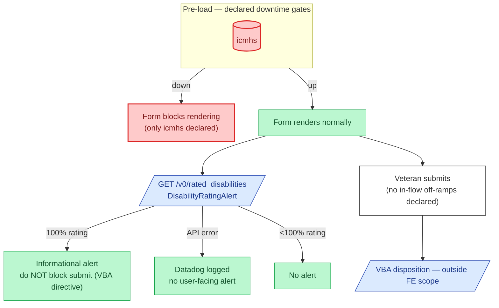

# 527EZ — Downtime & Off-ramps

Pension's external surface is unusually thin. The downtime declaration in `config/form.js:36` lists only `externalServices.icmhs` (TBD: confirm with team — 527EZ has no BGS/MVI prefill dependency declared, which is suspicious for a benefits form).

## Reading notes

- **icmhs is the only declared dependency.** If pension actually depends on BGS/MVI for prefill, the downtime list is stale and Veterans hitting an outage will see confusing errors. Open question for the team.
- **The disability-rating alert is the only conditional UI**, and it's never a blocker — VBA directive in #121731. Logging-only mode is via `pensionRatingAlertLoggingEnabled`.
- **No 527EZ-specific in-flow off-ramps.** This is unlike 686c, which has multiple pre-emptive RBPS-rejection branches.
