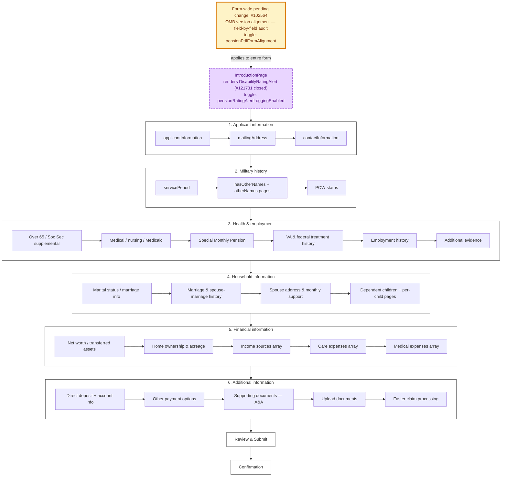

# 527EZ — Main Flow

Source: `src/applications/pensions/config/form.js` plus six chapter folders under `config/chapters/`. Page-level detail in chapters 3-5 is large (~25 pages each); collapsed to chapter-level here. See `config/chapters/` for the full per-page tree.

## Reading notes

- **The "Form-wide pending change: #102564" banner** signals that #102564 (OMB version alignment) touches every chapter — `pensionPdfFormAlignment` gates content everywhere.
- **`IntroductionPage`** is purple because the disability-rating alert (#121731) is gated behind `pensionRatingAlertLoggingEnabled`. Per VBA, the alert is informational — never block submission.
- **Chapter 5 sub-flows are heavy with array builders** (income, care, medical). Per-row schema changes need ID stability across save-in-progress.
- **0969 is a required supplemental** for some 527EZ applicants — content changes here may need parallel edits in `src/applications/income-and-asset-statement/`.
